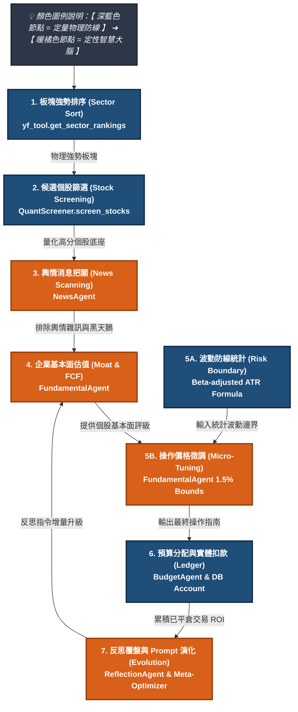

# 🛡️ Aegis-MAQS：投資研究與風控多代理人決策系統全面導論
**Investment Research & Risk Control Multi-Agent Decision System (Aegis-MAQS) - Comprehensive Introduction**

> [!NOTE]
> 本文件為「投資研究多代理人決策系統（Aegis-MAQS）」之核心演算法邏輯與系統架構白皮書。旨在詳細紀錄並釐清系統中「定量物理防線（定量電腦）」與「定性智慧大腦（定性人腦）」之間的邊界劃分、數據管線遞移、動態風險防線計算公式，以及「定量錨定，定性微調」的核心哲學。本文件做為系統跨會話（Cross-Session）知識傳承與 Git 版本控制之唯一真理源（Single Source of Truth），隨系統演化同步更新。

---

## 🌍 一、 哲學本源：隨機市場下的 Quantmental 與大模型定位

金融市場本質上是一個高度隨機且充斥雜訊的非線性複雜系統。在此系統中，純量化（Quantitative）與純定性（Qualitative）決策模式皆存在其致命的統計盲區：
1. **純量化模型的滯後性與盲目性**：量化模型過度依賴歷史價格與財務數據，對定性事件（如財務舞弊、核心團隊流失、訴訟爭議等黑天鵝事件）存在嚴重的**認知滯後**。
2. **純定性分析的心理偏誤與低效性**：人類分析師容易陷入主觀貪婪與恐懼的心理偏誤（Speculative Bias），難以嚴格執行紀律，且大範圍初篩效率低下。

為了解決此一矛盾，Aegis-MAQS 建立了 **Quantmental 雙軌交織決策管線**。我們將市場的不確定性進行解構：**我們不嘗試去「預測」隨機的短期價格波動，而是透過結構性的防禦去規避「系統性崩潰」，並利用「賠小賺大」的不對稱長期期望值實現持續獲利。**

### 1. 大模型（LLM）的定位與局限
大模型在系統中被定位為**「定性裁判、除錯者與邏輯監控者」**，而非單純的「價格預測器」。我們不強求大模型具備預知未來的能力，而是發揮其卓越的語意推理與模式識別長處：
*   **定性分析與護城河評估**：解讀複雜的新聞輿情、行業壁壘與定性風險，排除純數據無法捕捉的黑天鵝事件。
*   **貝氏反思與除錯（Bayesian Debugging）**：大模型不直接參與數值預測，但能通過對比「預期假設」與「真實損益結果」，辨識出系統性的邏輯死角（如模型對特定行業債務風險的過度寬容），並將其轉化為定性的防禦約束規則。

### 2. 為什麼大模型的「自我反思與盲點診斷」是可靠的？
大模型在「自我反思與盲點診斷」上的可靠性，**並非憑藉語意直覺，而是憑藉著「客觀的量化對帳單」與「語意偏誤識別（Semantic Bias Detection）」能力。** 其可靠性基於以下四個支柱：
*   **預期（推論日誌）與結果（真實帳本）的客觀對照**：大模型能將資料庫 `agent_inference_logs` 紀錄的當初買入推論（如：「*因法案補貼，基本面安全*」），與 `transaction_history` 實際損益進行並排對比，精準找出當初決策的邏輯矛盾（如：過度看重政策紅利，忽視主營毛利率下滑）。
*   **系統性失效模式的語意識別**：人類交易員容易有心理偏誤（如將虧損歸因於運氣），但 LLM 能在比對 10 筆平倉紀錄後，辨識出共同的「語意偏誤」（例如：模型屢次寬容高債務風險）。
*   **基準對照（Benchmarking）進行 Alpha 歸因**：透過對照同期大盤指數（如 `^GSPC` 或 `^TWII`）的表現，LLM 能排除大盤 Beta 波動，專注於「選股失敗」或「選股防禦成功」的實質 Alpha 歸因。
*   **定性邊界約束而非數值預測**：系統**不要求**大模型預測精確股價，而是要求其產出「定性防守規則」（例如：當負債比高於某門檻時，強制限制持倉權重）。這極大發揮了 LLM 的邏輯長處，避開了其算術短處。

### 3. 反思演化如何實現真正的「反隨機（Anti-Random）」？
在高度噪聲且本質隨機的金融市場中，如何讓反思的累積智慧具有真正的「反隨機性」，是決定系統能否持續穩健獲利的關鍵。

#### A. 隨機性的陷阱：反思是否在「學習噪聲」？
如果反思代理人的回饋過於敏感，例如：「*因為上週買入的某檔股票因為 CEO 突然爆出緋聞而大跌 15%，所以本期修正指令要求：未來必須全面避開所有創辦人年齡大於 60 歲的公司。*」
這就是典型的**擬合噪聲（Overfitting to Noise）**。這種反思不僅無法反隨機，反而會讓系統的邏輯變得支離破碎，最終降低未來的適應力。

#### B. 反思的核心機制
為了讓反思的貢獻具有「反隨機性」，Aegis-MAQS 的反思代理人遵循的是**貝氏更新（Bayesian Updating）**與**風險不對稱性原理**，而非單純的錯誤歸因。它著重於以下三個層面：
*   **風控參數的「波動率自我調校」（防守反隨機）**：
    市場價格的漲跌方向是高度隨機的，但市場波動率（Volatility）卻具有極強的「聚集性（Cluster）」與「非隨機性」（即大波動往往伴隨著大波動）。當反思代理人發現最近 10 筆交易頻繁跌破停損時，它做出的修正通常是：
    *   調寬停損區間（基於 ATR 的動態調整）。
    *   降低單一標的之持倉權重（遵循**凱利公式 Kelly Criterion**：當勝率不確定性變大或波動度上升時，應主動縮減曝險金額）。
    
    > [!TIP]
    > **「調整停損與權重」本身就是最強大的反隨機工具。**
    > 方向預測是隨機的，但「當我錯了只賠 1 元，當我對了能賺 3 元」這種盈虧比結構是系統可以透過規則鎖定的。反思機制的首要貢獻是優化這個不對稱的盈虧比。

*   **排除「系統性愚蠢」，而非預測「隨機性聰明」**：
    反思代理人所做的事情，本質上是 **「Negative Selection（否定選擇法）」**。它無法幫系統找出下一個必定翻倍的黑馬（因為那是隨機的），但它能幫系統避開「過去被證明是愚蠢的決策模式」（例如：在總經利率上行期，去買入高負債、零現金流的投機股）。透過不斷排除已知的邏輯漏洞，系統在隨機市場中存活的機率就會自然大增。

*   **修正「模型幻覺」，而非修正「市場走勢」**：
    反思的目的不是去改變市場，而是去校正大模型自身的「認知偏誤」。例如，大模型在閱讀大量樂觀的社群輿情後，容易產生「集體亢奮」的幻覺。反思代理人藉由客觀對帳單（真實損益）來戳破這個幻覺，迫使模型回到冷酷的數據面。

#### C. 最終的系統演化願景：具備統計優勢的賭場系統
這種反思機制，最終不會修正出一個「100% 預測未來的水晶球」（這違背了市場效率假說）。但它最終會演化出一個**「具備統計優勢的賭場系統」**：
1.  **精確買入權重**：自動在市場噪聲大時減倉（防守），在市場信號強、大盤順風時加倉（進攻）。
2.  **目標價與防禦停損點**：基於波動率（ATR）進行動態縮放，使單筆交易的「最大潛在虧損」被嚴格鎖定，而「潛在利潤」能伴隨趨勢自然延伸。
3.  **正期望值**：利用大數法則，在執行 100 筆交易後，憑藉著「小賠大賺」的不對稱架構，將隨機的市場噪聲轉化為穩健增長的淨值曲線。

反思的真正貢獻，就在於**「用結構的確定性，去防禦市場的隨機性」**。

---

## 📊 二、 架構藍圖：黃金十字架多代理人管線（The Golden Cross）

系統採用「黃金十字架」管線架構，展示從大盤趨勢研判到實體記帳的 7 大決策階段中，定量防線與定性大腦的具體權責分工：



### 📋 系統決策階段與模組權責對照表

| 決策階段 | 🛡️ 定量物理防線 (負責模組/工具) | 🧠 大模型定性決策 (負責代理人/Agent) |
| :--- | :--- | :--- |
| **1. 板塊趨勢選擇** | **100% 定量過濾**<br>👉 `yf_tool.get_sector_rankings`<br>*板塊 ETF 週回報率與動能定量排序* | **資金流向解讀**<br>👉 **`MarketAgent` (板塊動能分析師)**<br>*解讀巨觀資金面成因與板塊強勢邏輯* |
| **2. 候選個股篩選** | **100% 定量篩選**<br>👉 `QuantScreener.screen_stocks`<br>*5日價格動能、量能噴發因子、市值與日均量門檻* | **（無）**<br>*此階段不調用大模型，100% 物理過濾，極速降噪並節省 Token 成本* |
| **3. 個股消息面把關** | **數據基礎提供**<br>👉 `search_tool.get_stock_news`<br>*Scraper 即時網頁新聞檢索模組* | **輿情純度與黑天鵝預警**<br>👉 **`NewsAgent` (輿情消息分析師)**<br>*解讀新聞是實質利多還是投機炒作，預警黑天鵝* |
| **4. 企業基本面估值** | **數據基礎提供**<br>👉 `yf_tool.get_stock_financials`<br>*自動拉取財務三表、估值指標與債務結構* | **護城河剖析與估值陷阱判定**<br>👉 **`FundamentalAgent` (基本面估值師)**<br>*動態分析 PEG 廉價度、企業定價權、財務健康度* |
| **5. 風險防線設定** | **波動度物理邊界統計**<br>👉 `yf_tool.get_stock_financials`<br>*歷史 Beta 與 ATR-14 波動停損/停利參考價* | **最終操作區間與投資評級判定**<br>👉 **`FundamentalAgent` (基本面估值師)**<br>*結合大盤情境與反思指令，微調停損點並決定評級* |
| **6. 資金預算分配** | **持股對帳與記帳物理防線**<br>👉 `db_manager.py` & `check_portfolio.py`<br>*帳戶每日 NAV 智慧對帳與自動平倉控制* | **主觀勝率折價與動態預算配置**<br>👉 **`BudgetAgent` (預算管理與持倉代理人)**<br>*讀取個股定性評級，動態扣除可用餘額與分配購買股數* |
| **7. 覆盤反思與演化** | **已平倉交易 ROI 追蹤**<br>👉 `db.get_recent_inference_logs_with_roi`<br>*真實交易績效與推論日誌資料庫綁定技術* | **定性反思與 Prompt 版本遞增升級**<br>👉 **`ReflectionAgent` (自我修法師)**<br>*每週反思定性指令*<br>👉 **`MetaPromptOptimizer` (自適應演化引擎)**<br>*Meta-Reflection 生成優化 Prompt 並升級版本* |

---

## ⚖️ 三、 戰術執行：定量統計錨定與不對稱盈虧比（個股盾牌）

在個股操作階段，系統實現了「定量錨定，定性微調」的深度耦合，藉由硬性的波動度公式限制損失，創造不對稱的盈虧結構。

### 1. 停損停利防線：定量統計錨定，大腦 1.5% 微調
系統拋棄市場上粗暴的「統一跌 8% 停損、漲 15% 停利」設計，改採**「Beta 調整之 ATR（真實波幅均值）波動通道算法」**進行物理錨定，使風險防守自動適應個股的自然波動率。

#### 📐 計算公式
系統在計算波動停損停利參考價時，遵循以下數學關係：
```text
# Step A: 限制 Beta 邊界 (Winsorization) 以平滑極端值，防止異常個股扭曲通道
beta_bounded = max(0.3, min(Beta, 3.0))

# Step B: 進行開根號統計縮放 (Square Root Scaling)
beta_adj = sqrt(beta_bounded)

# Step C: 計算動態波動乘數
# k1: 停損乘數 (以 2.0 倍 ATR 日震幅為基礎)
# k2: 停利乘數 (以 3.0 倍 ATR 日震幅為基礎)
k1 = 2.0 * beta_adj
k2 = 3.0 * beta_adj

# Step D: 計算建議停損與停利參考價 (定量統計錨定底座)
Suggested_Stop_Loss = Buy_Price - (k1 * ATR_14)
Suggested_Target_Price = Buy_Price + (k2 * ATR_14)
```

#### 備援安全防線 (Fallback Line)
若因個股新上市或數據庫暫時缺失而無 ATR_14 或 Beta 數據時，系統強制套用以下物理防線：
```text
Stop_Loss_Fallback = Buy_Price * 0.92  (固定 8% 停損)
Target_Price_Fallback = Buy_Price * 1.15  (固定 15% 停利)
```

#### 🧠 大模型定性 1.5% 彈性微調
上述物理錨定價算出後，會作為 Context 灌入 `FundamentalAgent` 中。大模型被施加了強剛性紀律約束：
1.  **紀律約束**：必須以系統建議的波動參考價為決策錨點。
2.  **定性微調**：僅允許大模型在 **正負 1.5%** 的極小範圍內，結合「歷史壓力支撐位」或「心理整數關卡」進行微調（例如：將定量算出的 `91.43` 微調為更具心理支撐力的整數 `91.00` 元）。這既保證了統計學的剛性底線，又保留了專業交易員的定性靈活性。

### 2. 資金分配與生殺大權（Budget Veto & Sizing）
隨機市場中，任何個股都有暴雷風險。系統透過評級與資金大小物理掛鉤，實施持倉分配與安全準備金限制：
*   **資金安全鎖（Reserved Cash）**：系統要求台股帳戶必須保留 200,000 TWD，美股帳戶保留 20,000 USD 作為「絕對安全準備金」，任何時候皆不可動用，防範系統性流動性危機。
*   **評級決定預算 (Budget Veto)**：即使量化篩選極度看好某個股，若 `FundamentalAgent` 評級為 Hold，預算將被降至最低；若為 Sell 則直接否決買入。
*   **波動度調節持倉（Sizing Parity）**：`BudgetAgent` 根據個股波動率自動調整分配金額。**波動率極高的股票會被自動分配較少的股數與資金**，防止單一高風險股票的隨機大跌重創總淨值。

```text
大模型評級為 Strong Buy ➔ BudgetAgent 動態分配 20% ~ 25% 資金 (高勝率重倉)
大模型評級為 Buy        ➔ BudgetAgent 動態分配 10% ~ 15% 資金 (中性配置)
大模型評級為 Hold       ➔ BudgetAgent 動態分配 5% 資金 (定性推翻，資金物理閹割)
```

---

## 🛡️ 四、 策略防線：總經情境閘門與風控哨兵（組合盾牌）

個股防守確立後，系統建立整體投資組合的保護網，用以防禦大盤系統性崩盤（Beta 崩潰）與組合性爆倉危機。

### 1. 總經情境閘門（Regime Shifting）
市場方向雖隨機，但大盤的趨勢狀態（Market Regime）卻具有明顯的延續性。
*   **實作位置**：`MacroAgent` 決策與 `monitor_performance.py`
*   **運作方式**：
    *   系統每週六早上執行總經評估，並將市場打上情境標籤（如 `BULL_RISK_ON` 或 `BEAR_RISK_OFF`）。
    *   **情境干預**：一旦市場被判定為 `BEAR_RISK_OFF`（熊市避險），這個標籤會作為硬規則干預所有代理人。此時系統會：
        1. 大幅收緊新標端的買入門檻。
        2. 強制調緊在庫股的停損點（更早平倉離場）。
        3. 在庫持股的建議權重上限被自動下修，藉此避開系統性大跌的「屠殺期」，轉為防守模式保留現金。

### 2. 閉環風控哨兵（Watchdog）
*   **實作位置**：`monitor_performance.py` 的 LINE Watchdog 機制
*   **運作方式**：
    *   **回撤警戒線（MDD > 3%）**：風控哨兵每日收盤後自動計算台股與美股口袋的「最大回撤（MDD）」與「自峰值累計降幅」。一旦回撤突破 3.0% 的風險閥值，系統會立即拉響警報，暫停主動買入。

---

## 🧠 五、 自主進化：自適應 Prompt 演化機制 (Phase 7: Self-Evolution)

這套系統不單只是一個交易程式，它是一個藉由外掛資料庫記憶體，不斷在實戰中優化的「自學習生命體」。

當沙盒模擬進行時，隨著每日對帳（`check_portfolio.py`）持續判定平倉，系統會自動在資料庫累積實際交易損益（ROI）。每週週報生成管線末端會自動啟動反思覆盤流程：

### 1. 貝氏反思與除錯（Bayesian Debugging）
*   **實作位置**：`ReflectionAgent`
*   **運作方式**：
    *   **預期與結果對應**：系統將資料庫 `agent_inference_logs` 中記錄的買入假設，與 `transaction_history` 實際損益及同期大盤基準績效進行並排對稱分析。
    *   **模式識別與定性指令**：透過比對近 10 筆平倉紀錄，`ReflectionAgent` 識別系統性偏誤，生成定性的 `reflection_directives`（反思修正指令），並儲存於 `agent_inference_logs`（`agent_name = 'ReflectionAgent'`）。

### 2. Prompt 自適應演化（Self-Evolution）
*   **實作位置**：`MetaPromptOptimizer`
*   **運作方式**：
    1.  **增量編譯模式 (Incremental Update)**：
        Meta-Agent 根據反思指令，在保持 `FundamentalAgent` 核心結構與輸出 Markdown 格式不變的前提下，於 Prompt 末尾增量追加 **「【自適應演化之最新交易紀律防線】」**。
    2.  **版本遞增與即時啟用**：
        新 Prompt 自動寫入資料庫並標記為 active 啟動，版本號自動遞增（如 `v1.0.0` ➔ `v1.0.1`）。下一次執行個股查詢或週報時，大模型會直接載入這套帶有「痛過記憶」的新提示詞，完成在「模型權重凍結」下的軟升級。

```text
  [ 歷史平倉數據與大盤基準對照 ]
               │
               ▼
   [ ReflectionAgent 找出邏輯盲區 ]
               │
               ▼
  [ 產生定性反思指令 reflection_directives ] ──> 寫入本地 DB 儲存
               │
               ▼
   [ 執行時：動態將反思指令注入大模型 Context ] ──> 大模型大腦即時完成升級
```

---

## 🎯 六、 系統定位與適用族群分析：從獨立投資人到精品機構的數字化防線

Aegis-MAQS 系統作為一套「模組化、可自我進化的投研與風控數字化基礎建設」，其高剛性的風控計算與定性大模型雙軌架構，並非為了一般短線投機客設計，而是精準定位於解決以下四個核心族群的痛點，以極精簡的人力撬動機構級的產能：

### 1. 科技型獨立投資人與專職交易員 (Individual Pro Traders)
*   **痛點解決**：獨立交易員往往面臨**「監控精力有限」**與**「主觀情緒干擾（Speculative Bias）」**的致命瓶頸。
*   **核心價值**：
    *   **無情執行的風控鐵律**：0-Token 的物理風控對帳（ATR/Beta 停損）會在 2 秒內無痛平倉，強制執行紀律，排除主觀遲疑。
    *   **分析效率放大器**：一鍵完成美股與台股焦點板塊的深度基本面與輿情把關，縮短每日研究時間。
    *   **AI 交易教練**：透過 `ReflectionAgent` 與對帳單的客觀對照，指出其「在特定宏觀情境下的估值邏輯偏誤」，實現交易智慧的貝氏更新。

### 2. 精品家族辦公室與私人財富管理機構 (Family Offices & RIAs)
*   **痛點解決**：管理資產規模（AUM）在 1,000 萬至 1 億美元之間的精品家辦或獨立投資顧問（RIA），其投研團隊通常極為精簡（2~5 人），無力僱用大量分析師覆蓋多元資產，且極度需要「決策合規與審計防線」。
*   **核心價值**：
    *   **一人成軍的虛擬投研團隊**：系統中 7 大 Agent 的協作，即為一個「數字化投研部門」的縮影（`Macro` 總經 ➔ `Market` 策略 ➔ `Fundamental` 估值 ➔ `News` 輿情 ➔ `Reflection/Budget` 風控），以極低 Token 成本提供機構級生產力。
    *   **決策留痕與防線審計 (Audit Trail)**：這是財富管理中極為珍貴的合規武器。當客戶或家族成員質詢「當初為什麼要買這檔股票」時，系統能一鍵調出資料庫 `agent_inference_logs` 中當時的總經標籤、輿情純度與 ATR 停損錨點，提供完美的合規留痕與說明。

### 3. 中小型私募避險基金與自營交易商 (Boutique Hedge Funds & Prop Firms)
*   **痛點解決**：中小型避險基金需要不斷尋找 Alpha，並在將實體資金投入新策略前進行低成本的前向測試（Forward Testing）。
*   **核心價值**：
    *   **策略沙盒孵化器 (Sandbox Incubator)**：系統內置的 30 天實戰沙盒機制（自動每日扣款、NAV 結算、年化 Sharpe/Sortino 與最大回撤 MDD 計算、LINE 推送），是避險基金經理人（PM）在小規模測試新因子或新策略時，最理想的低成本、零代碼干預之「實戰前向觀測沙盒」。
    *   **Quantmental 雙軌共生驗證**：純量化（Quant）容易死於定性黑天鵝，純主觀（Mental）則容易死於紀律鬆散。本系統「定量統計錨定 ＋ 大模型定性微調」提供了一套完美的 Quantmental 閉環，非常適合作為 PM 的決策輔助系統。

### 4. 財經付費訂閱媒體與投資顧問創作者 (Investment Newsletter Creators)
*   **痛點解決**：財經自媒體與投顧創作者，每週都需要撰寫高質量的台股/美股投資報告，寫作產能是其商業模式的最大瓶頸。
*   **核心價值**：
    *   **半自動高質量報告生成器**：系統自動產出的報告語意嚴謹、排版精美且充斥金融工程術語。自媒體創作者只需將其稍加潤飾，即可作為高附加價值的付費訂閱週報，極大釋放了產能，實現商業規模的放大。

---

## 📝 七、 文件維護與升級規範

1. **變更追蹤**：凡是修改 `yahoo_finance.py` 中的波動停損停利倍數、`screener.py` 中的篩選因子權重，或是 Agent 的核心角色，必須同步在本手冊中修訂對應的算式、架構圖與風控邏輯。
2. **版本共存**：此手冊應常駐於專案的工作目錄（`Aegis-MAQS/docs/Aegis-MAQS_Introduction.md`），做為每次 Agent 喚醒時進行架構對齊與自我教育的 Single Source of Truth（唯一真理源）。
