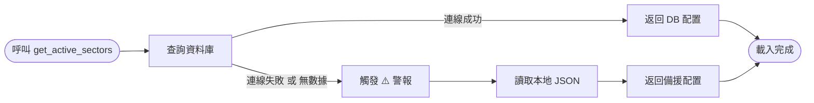
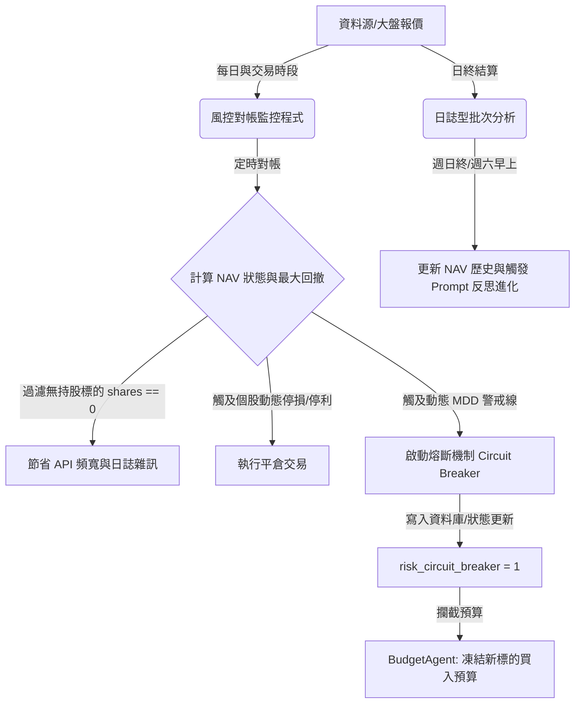

# 🛠️ Aegis-MAQS 技術維護與運行指引手冊
**Technical Operations & Database Schema Manual**

本文件為「投資研究與風控多代理人決策系統（Aegis-MAQS）」的技術維護與操作手冊。本手冊旨在為工程師、量化研究員及運維人員提供系統部署、資料庫 Schema 設計、動態板塊配置機制、每日排程腳本運行及故障排除的完整指南。

本文件為 [Aegis-MAQS_Introduction.md](file:///home/gordon/learning/program/python/Aegis-MAQS/docs/Aegis-MAQS_Introduction.md) 的技術對照手冊，雙軌共存以維護系統架構的一致性。

---

## 📂 一、 系統運行環境與目錄結構

Aegis-MAQS 系統核心模組位於 `backend/` 目錄中，其完整且詳細的樹狀架構如下：

```text
backend/
├── .env                    # 全域環境變數配置 (包含 Gemini API、LINE Token、MySQL 連線資訊)
├── .env.template           # 環境變數範本檔
├── Pipfile                 # pipenv 套件依賴管理檔
├── Pipfile.lock            # 套件相依性鎖定檔
├── aegis_cli.py            # CLI 命令入口：僅進行參數解析與指令分發，業務邏輯已解耦移出 (Thin Wrapper)
├── check_portfolio.py      # 持倉對帳與物理波動 ATR/Beta 停損平倉腳本 (0-Token 風控哨兵)
├── monitor_performance.py  # 30天沙盒實戰績效監控、LINE 日報推送與網頁看板渲染
├── sync_data.py            # 歷史淨值與對帳數據之外部同步與校正工具
├── sync_sectors_config.py  # 板塊與成分股組態之雙向資料庫同步工具 (JSON ➔ DB)
├── test_agent_system.py    # 系統整合測試腳本 (Agent 連接與推論測試)
├── test_mysql.py           # MySQL 連線與讀寫測試腳本
├── test_utils.py           # 系統核心工具與風控單元測試腳本 (Regression Testing)
├── logs/                   # 系統執行日誌與智慧對帳 HTML 看板
│   ├── check_portfolio.log    # 風控哨兵執行日誌
│   ├── dashboard.html         # 投研與帳戶 NAV 視覺化對帳看板
│   ├── generate_report.log    # 週報生成管線執行日誌
│   └── monitor_performance.log# 績效監控執行日誌
├── scratch/                # 系統測試、提示詞演化回滾與臨時維護測試腳本 (不影響正式運行)
└── core/
    ├── agents/             # 多代理人決策核心 (LLM 邏輯鏈 CoT 推理)
    │   ├── base_agent.py          # 代理人基底類別 (封裝 LLM API、重試、提示詞載入)
    │   ├── budget_agent.py        # 預算配置代理人 (計算凱利公式、分配購買股數與預算)
    │   ├── fundamental_agent.py   # 基本面估值代理人 (評估財報健康度、護城河與估值)
    │   ├── macro_agent.py         # 總體經濟分析代理人 (分析宏觀走勢並產出大盤 regime 標籤)
    │   ├── market_agent.py        # 板塊與技術分析代理人 (評估板塊強度與技術乖離指標)
    │   ├── news_agent.py          # 輿情消息分析代理人 (新聞輿情過濾與情緒分析)
    │   ├── reflection_agent.py    # 決策反思代理人 (回測歷史交易、產出增量反思修正指令)
    │   └── writer_agent.py        # 總編輯合成代理人 (彙整各方意見，編撰最終 HTML/Markdown 週報)
    ├── regime/             # 市場狀態偵測模組 (Regime Detection)
    │   ├── detector.py            # 計算 Hurst 指數與 ADX-14 判定市場處於趨勢或均值回歸
    │   └── registry.py            # 市場狀態持久化快取 (market_regime.json) 讀寫管理器
    ├── risk/               # 波動與物理風控模組 (Risk Control)
    │   ├── risk_manager.py        # 根據大盤 Regime 與 Beta-Adjusted ATR 計算個股操作邊界與停損停利點
    │   └── trailing_stop.py       # 保本里程碑移動停損機制 (觸及 +1.0 ATR 自動將停損調為買入保本價)
    ├── screener/           # 量化選股引擎模組 (Stock Screening)
    │   ├── base.py                # 選股器基底類別 (定義成分股載入、Projected Volume 投影演算法)
    │   ├── factory.py             # 策略選股工廠 (根據 Regime 路由至動量策略或均值回歸策略)
    │   ├── momentum_strategy.py   # 動量趨勢選股策略 (動量因子、成交量增幅排行)
    │   └── reversion_strategy.py  # 拉回均值回歸選股策略 (長線多頭、短線拉回超賣區)
    ├── visualization/      # 績效視覺化渲染模組 (Performance Dashboard)
    │   ├── dashboard_renderer.py  # 讀取 DB 資料與 NAV 歷史，使用 Jinja2 渲染 HTML 看板
    │   └── templates/
    │       └── dashboard_tpl.html # 看板之 Jinja2 HTML 樣式範本
    ├── utils/              # 通用公用程式模組 (Shared Utilities)
    │   ├── formatters.py          # CJK 中日韓字元寬度對齊格式化器
    │   └── parsers.py             # LLM 輸出清洗與 Regex 價格/區間提取器
    ├── pipelines/          # 核心流程管線編排模組 (Workflow Pipelines)
    │   └── research_pipeline.py   # 系統核心投研與分析管線 (包含週報、個股查詢等核心工作流)
    ├── tools/              # 實體功能輔助工具 (Helper Tools)
    │   ├── line_notifier.py       # LINE 訊息 API 發送器 (日報與崩潰報警)
    │   ├── screener.py            # 歷史量化選股報告產生與持久化器
    │   ├── taiwan_stock_names.py  # 台灣股票名稱與 Ticker 映射資料庫
    │   ├── utils.py               # 通用工具函式 (如日誌 rotation 邏輯)
    │   ├── valuation_engine.py    # 投行級量化估值引擎 (計算 DCF 及同行比較內在價值)
    │   ├── web_search.py          # DuckDuckGo/GNews 聯網搜尋與爬取器
    │   └── yahoo_finance.py       # Yahoo Finance 歷史與即時技術指標、成分股爬取器
    ├── config.py           # 全域系統路徑與環境變數組態載入器
    ├── db_manager.py       # 資料庫 Schema 初始化與 SQL 抽象介面 (MySQL / SQLite 雙模備援)
    └── data/
        ├── cache/          # API 快取與大盤狀態 JSON 本地快取 (12小時過期)
        ├── db/             # 本地 SQLite 資料庫 (SQLite 備援存檔)
        │   └── investments.db
        ├── reports/        # 週報本機存檔目錄
        └── sectors_config.json # 本地板塊與成分股備援組態設定檔
```

### ⚙️ 環境變數配置 (.env)
系統執行前必須配置 `backend/.env`。核心變數如下：
* `GEMINI_API_KEY`: Google Gemini 大模型之 API 金鑰。
* `LINE_CHANNEL_ACCESS_TOKEN` & `LINE_USER_ID`: 每日風控與報告推送警報通知。
* `DB_TYPE`: `mysql` 或 `sqlite`（控制雙模資料庫切換）。
* `MYSQL_HOST`, `MYSQL_PORT`, `MYSQL_USER`, `MYSQL_PASSWORD`, `MYSQL_DB`: MySQL 資料庫連線配置。

---

## 🗄️ 二、 核心數據模型與關聯（Database Schema）

Aegis-MAQS 採用關聯式資料庫記錄從「總經情境」、「個股決策推論」到「實體交易對帳」與「反思學習」的完整閉環。以下為核心資料表設計：

### 1. 板塊管理模組 (Sectors & Constituents)
用以存儲動態市場分類與追蹤標的，支援動態變更而無需部署程式碼。

#### 🔹 板塊登記表 (`sector_registry`)
| 欄位名稱 | 數據類型 (MySQL / SQLite) | 屬性 | 說明 |
| :--- | :--- | :--- | :--- |
| `id` | `INT` / `INTEGER` | AUTO_INCREMENT, PK | 板塊唯一識別碼 |
| `region` | `VARCHAR(20)` / `TEXT` | NOT NULL | 市場區域 (如 `US`, `Taiwan`) |
| `sector_code` | `VARCHAR(50)` / `TEXT` | UNIQUE, NOT NULL | 板塊 Ticker / 代碼 (如 `XLF`, `0050.TW`) |
| `sector_name` | `VARCHAR(100)` / `TEXT` | NOT NULL | 繁體中文板塊名稱 |
| `target_type` | `VARCHAR(20)` / `TEXT` | NOT NULL | `constituents` (成分股模式) 或 `etf` (單一ETF模式) |
| `is_etf` | `TINYINT` / `INTEGER` | DEFAULT 1, NOT NULL | 是否為 ETF（0 代表股票Proxy，需爬取財報；1 代表真實ETF，繞過財報爬取） |
| `is_active` | `TINYINT` / `INTEGER` | DEFAULT 1, NOT NULL | 是否啟用 (1=啟用, 0=停用) |
| `created_at` | `TIMESTAMP` / `TIMESTAMP` | DEFAULT CURRENT_TIMESTAMP | 建立時間 |

#### 🔹 板塊成分股對照表 (`sector_constituents`)
| 欄位名稱 | 數據類型 (MySQL / SQLite) | 屬性 | 說明 |
| :--- | :--- | :--- | :--- |
| `id` | `INT` / `INTEGER` | AUTO_INCREMENT, PK | 成分股關聯唯一識別碼 |
| `sector_id` | `INT` / `INTEGER` | FK (sector_registry.id), NOT NULL | 所屬板塊 ID (級聯刪除 ON DELETE CASCADE) |
| `ticker` | `VARCHAR(20)` / `TEXT` | NOT NULL | 股票代碼 (如 `AAPL`, `2330.TW`) |
| `company_name` | `VARCHAR(100)` / `TEXT` | DEFAULT '' | 企業名稱（選填） |
| `created_at` | `TIMESTAMP` / `TIMESTAMP` | DEFAULT CURRENT_TIMESTAMP | 建立時間 |
* **唯一索引約束**：`UNIQUE KEY uq_sector_ticker (sector_id, ticker)` 防止重複登記。

---

### 2. 投研決策與交易對帳模組 (Inference & Ledger)
用以實現「決策留痕（Audit Trail）」與「0-Token 物理風控」。

#### 🔹 投資建議與持倉表 (`recommendations`)
記錄 `WriterAgent` 根據多代理人管線生成的個股評級與最終操作目標。
| 欄位名稱 | 數據類型 (MySQL / SQLite) | 屬性 | 說明 |
| :--- | :--- | :--- | :--- |
| `id` | `INT` / `INTEGER` | AUTO_INCREMENT, PK | 建議案唯一識別碼 |
| `report_date` | `VARCHAR(50)` / `TEXT` | NOT NULL | 所屬投研週報之生成日期 (YYYY-MM-DD) |
| `region` | `VARCHAR(50)` / `TEXT` | NOT NULL | 市場區域 (`US` 或 `Taiwan`) |
| `ticker` | `VARCHAR(50)` / `TEXT` | NOT NULL | 標的代碼 |
| `company_name` | `VARCHAR(255)` / `TEXT` | NOT NULL | 企業中文/英文名稱 |
| `recommend_price`| `DOUBLE` / `REAL` | NOT NULL | 推薦買入時之參考價格 |
| `recommend_reason`| `TEXT` / `TEXT` | | 大模型評估之核心基本面護城河理由 |
| `target_price` | `DOUBLE` / `REAL` | | 定量錨定、定性微調之停利參考價 |
| `stop_loss` | `DOUBLE` / `REAL` | | 定量錨定、定性微調之物理停損參考價 |
| `rating` | `VARCHAR(50)` / `TEXT` | | 大模型最終評級 (`Strong Buy`, `Buy`, `Hold`, `Sell`) |
| `is_active` | `INT` / `INTEGER` | DEFAULT 1 | 是否在持倉監控中 (1=在庫持股中, 0=已平倉出場) |
| `close_price` | `DOUBLE` / `REAL` | | 平倉出場之真實結算價格 |
| `close_date` | `VARCHAR(50)` / `TEXT` | | 平倉日期 (YYYY-MM-DD) |
| `performance` | `DOUBLE` / `REAL` | | 單筆平倉報酬率 ROI (例如 `0.15` 代表 +15%) |
| `invested_amount`| `DOUBLE` / `REAL` | DEFAULT 0.0 | 此交易案實際動用之預算金額 (本幣) |
| `shares` | `DOUBLE` / `REAL` | DEFAULT 0.0 | 買入之虛擬/實體總股數 |
| `pnl` | `DOUBLE` / `REAL` | DEFAULT 0.0 | 此交易案之實現損益金額 (本幣) |
| `created_at` | `TIMESTAMP` / `TIMESTAMP` | DEFAULT CURRENT_TIMESTAMP | 建立時間 |

#### 🔹 虛擬資金帳本表 (`capital_ledger`)
維護帳戶的預算上限與風控安全金門檻。
| 欄位名稱 | 數據類型 (MySQL / SQLite) | 屬性 | 說明 |
| :--- | :--- | :--- | :--- |
| `id` | `INT` / `INTEGER` | AUTO_INCREMENT, PK | 帳本唯一碼 |
| `currency` | `VARCHAR(10)` / `TEXT` | UNIQUE, NOT NULL | 貨幣代碼 (`USD` 或 `TWD`) |
| `available_capital`| `DOUBLE` / `REAL` | NOT NULL | 可用投資預算金額 (當前購買力) |
| `reserved_cash` | `DOUBLE` / `REAL` | NOT NULL | **絕對安全準備金**（台股預設 20 萬，美股預設 2 萬，永不動用） |
| `updated_at` | `TIMESTAMP` / `TIMESTAMP` | DEFAULT CURRENT_TIMESTAMP | 最後更新時間 |

#### 🔹 實體交易歷史表 (`transaction_history`)
記錄每一次的虛擬/實體下單明細，做為反思對帳的依據。
| 欄位名稱 | 數據類型 (MySQL / SQLite) | 屬性 | 說明 |
| :--- | :--- | :--- | :--- |
| `id` | `INT` / `INTEGER` | AUTO_INCREMENT, PK | 交易明細識別碼 |
| `rec_id` | `INT` / `INTEGER` | NOT NULL | 對應的推薦案 ID (`recommendations.id`) |
| `action` | `VARCHAR(50)` / `TEXT` | NOT NULL | 交易動作 (`BUY`, `SELL_PROFIT_TARGET`, `SELL_STOP_LOSS`) |
| `ticker` | `VARCHAR(50)` / `TEXT` | NOT NULL | 標的代碼 |
| `currency` | `VARCHAR(10)` / `TEXT` | NOT NULL | 交易結算貨幣 |
| `shares` | `DOUBLE` / `REAL` | NOT NULL | 成交股數 |
| `price` | `DOUBLE` / `REAL` | NOT NULL | 成交單價 |
| `amount` | `DOUBLE` / `REAL` | NOT NULL | 總交易金額 (`shares` * `price`) |
| `roi` | `DOUBLE` / `REAL` | DEFAULT 0.0 | 平倉報酬率 (限 SELL 時計算) |
| `pnl` | `DOUBLE` / `REAL` | DEFAULT 0.0 | 實現損益金額 (限 SELL 時計算) |
| `created_at` | `TIMESTAMP` / `TIMESTAMP` | DEFAULT CURRENT_TIMESTAMP | 交易時間 |

---

### 3. LLM 運作與自主反思進化模組 (Inference Logs & Registry)
記錄大模型的決策軌跡與 Prompt 版本控制。

#### 🔹 大模型推理日誌表 (`agent_inference_logs`)
| 欄位名稱 | 數據類型 (MySQL / SQLite) | 屬性 | 說明 |
| :--- | :--- | :--- | :--- |
| `id` | `INT` / `INTEGER` | AUTO_INCREMENT, PK | 日誌識別碼 |
| `rec_id` | `INT` / `INTEGER` | FK (recommendations.id) | 關聯的交易建議 ID (平倉時對帳用) |
| `agent_name` | `VARCHAR(50)` / `TEXT` | NOT NULL | 決策代理人名稱 (如 `FundamentalAgent`, `NewsAgent`) |
| `ticker` | `VARCHAR(20)` / `TEXT` | | 分析之股票標的 (若為總經則為空) |
| `input_prompt` | `LONGTEXT` / `TEXT` | NOT NULL | 發送給大模型之完整 Prompt |
| `output_response`| `LONGTEXT` / `TEXT` | NOT NULL | 大模型輸出之 JSON/Markdown 原始回覆 |
| `prompt_version` | `VARCHAR(20)` / `TEXT` | NOT NULL | 當時使用之 Prompt 版本號 |
| `created_at` | `TIMESTAMP` / `TIMESTAMP` | DEFAULT CURRENT_TIMESTAMP | 分析生成時間 |

#### 🔹 自適應 Prompt 註冊表 (`prompt_registry`)
記錄隨實戰反思不斷進化的 Prompts。
| 欄位名稱 | 數據類型 (MySQL / SQLite) | 屬性 | 說明 |
| :--- | :--- | :--- | :--- |
| `id` | `INT` / `INTEGER` | AUTO_INCREMENT, PK | 唯一碼 |
| `agent_name` | `VARCHAR(50)` / `TEXT` | NOT NULL | 代理人名稱 |
| `system_prompt` | `LONGTEXT` / `TEXT` | NOT NULL | 系統提示詞（包含自適應反思修正後之內容） |
| `version` | `VARCHAR(20)` / `TEXT` | NOT NULL | 版本號 (如 `v1.0.0`, `v1.0.1`) |
| `is_active` | `INT` / `INTEGER` | DEFAULT 1 | 是否啟用 (1=當前使用, 0=歷史存檔) |
| `performance_score`| `DOUBLE` / `REAL` | DEFAULT 0.0 | 大模型此版本之滾動績效評分 |
| `updated_at` | `TIMESTAMP` / `TIMESTAMP` | DEFAULT CURRENT_TIMESTAMP | 更新時間 |
* **唯一索引約束**：`UNIQUE KEY idx_agent_version (agent_name, version)` 確保版本序號不衝突。

---

## 🔌 三、 板塊與成分股之設定、使用與管理

系統採用「資料庫優先、本地 JSON 備援、Git 雙向同步」的動態管理架構，以確保運行期的高可用性與版本控制。

### 1. 設定 (Configuration)：本地 JSON 配置規範
本地備援配置檔案存放於 `core/data/sectors_config.json`，作為系統的靜態真理源。
* **格式範例**：
  ```json
  "Taiwan": {
      "0055.TW": {
          "name": "金融保險",
          "target_type": "constituents",
          "is_etf": true,
          "constituents": ["2881.TW", "2882.TW", "2891.TW"]
      }
  }
  ```
* **核心欄位技術定義**：
  * `target_type`：板塊追蹤模式。可設為 `constituents`（讀取下方 constituents 清單中的代表個股）或 `etf`（直接交易此 ETF 代號本身，如直接買入 0055.TW）。
  * `is_etf`：基金屬性標記。設為 `true` 代表該代號是 ETF，數據模組會繞過個股 P/E 與債務等財報爬蟲（防止爬蟲當機）；設為 `false` 則代表該代號是股票 Proxy，系統會對其進行完整的估值分析。
  * `constituents`：成分股清單。列出該板塊底下的股票代號數組。

### 2. 使用 (Usage)：資料庫優先與備援 Fallback 機制
在系統運行期（例如執行 `aegis_cli.py` 進行動態篩選，或運行 `check_portfolio.py` 進行盤後對帳），系統會呼叫 [get_active_sectors(region_code)](file:///home/gordon/learning/program/python/Aegis-MAQS/backend/core/db_manager.py#L434-L487) 函數來獲取該市場（TWD / USD）的板塊與成分股配置。其詳細運作機制如下：

#### 執行步驟解析：
1. **第一優先：資料庫動態讀取 (MySQL / SQLite)**
   * **資料庫查詢**：系統建立連線後，會優先對 `sector_registry` 進行 SQL 查詢，篩選出符合指定區域且 `is_active = 1` 的所有啟用板塊。
   * **成分股關聯**：針對篩選出的每個板塊，系統會使用其 `id` 作為外鍵，進一步查詢 `sector_constituents` 獲取該板塊下登記的所有成分股 Ticker。
   * **結構重組**：最後，系統將從資料庫獲取的表數據，在記憶體中重組成與本地 JSON 格式完全一致的嵌套字典（Dictionary），返回給呼叫端。

2. **第二備援：自動 Fallback 機制 (靜態 JSON)**
   * **異常捕獲**：若資料庫發生連線超時、資料庫鎖定、連線埠被阻擋或資料表為空（未 Seed），系統會捕獲該異常，並在後台發出警告日誌：
     `[!] Warning: Failed to load sectors from database. Falling back to config.py.`
   * **本地載入**：系統立即繞過資料庫，改為從 [core/config.py](file:///home/gordon/learning/program/python/Aegis-MAQS/backend/core/config.py) 中加載在啟動時已由本地 `sectors_config.json` 緩存的板塊組態。
   * **無痛返回**：將本地 JSON 配置字典返回給呼叫端，確保上層的選股分析與停損對帳流程 100% 正常執行。

#### 💡 本機制的技術價值與設計優勢：
* **零停機保障 (Zero Downtime)**：對帳與平倉是高剛性的任務，若資料庫臨時異常，Fallback 機制能防止整個風控對帳腳本崩潰，確保即便在 DB 損壞的極端情況下，波動停損平倉依然能安全執行。
* **本地開發便利性**：開發者在本地測試單一模組時，無需在本地機器啟動 MySQL 伺服器，系統會自適應地退回 JSON 檔案模式，極大降低了本機開發調試的複雜度。

#### 安全備援流程圖：


### 3. 管理 (Management)：雙向同步工具與 Git 橋樑
系統在運行期支持隨時在資料庫調整板塊，並透過 `sync_sectors_config.py` 工具進行雙向管理，確保變更可被 Git 版本控制追蹤：

* **導入 (Seeding / 本地到資料庫)**：
  當開發端在本地 `sectors_config.json` 新增或修改成分股後，執行以下指令將變更同步寫入資料庫：
  ```bash
  pipenv run python sync_sectors_config.py --import
  ```
* **導出 (Exporting / 資料庫到本地)**：
  當運維人員直接在資料庫手動修改、新增板塊後，執行以下指令將配置導出並覆蓋本地的 `sectors_config.json`，隨後即可進行 Git Commit 提交：
  ```bash
  pipenv run python sync_sectors_config.py --export
  ```

---

## ⏱️ 四、 沙盒模擬與自動化排程（Workflow Operations）

Aegis-MAQS 的 30 天實戰觀測期依賴兩個核心風控對帳腳本運行。這兩個腳本應該被設定在 Linux 系統的 `crontab` 中每日定時執行。

### 1. 持倉對帳與波動停損腳本 (`check_portfolio.py`)
* **職責**：0-Token 物理風控。每日收盤後執行。
* **主要工作流**：
  1. 讀取資料庫中 `is_active = 1` 的持股明細。
  2. 使用 `yahoo_finance` API 抓取現價。
  3. 比對現價是否**低於 `stop_loss`**（停損觸發）或**高於 `target_price`**（停利觸發）。
  4. 一旦觸發，立即將 available_capital 加回（現價 * 股數），在 `transaction_history` 寫入 SELL 紀錄，並將 recommendations 狀態設為 0 (平倉)。
  5. 結算並記錄當日的 Portfolio NAV（總淨值 = 可用資金 + 安全準備金 + 在庫持股價值）。
  6. 計算該貨幣組合的滾動統計指標：**夏普比率 (Sharpe Ratio)**、**索提諾比率 (Sortino Ratio)** 以及 **最大回撤 (MDD)**。
* **CLI 指令**：
  ```bash
  # 對全域 (US 與 Taiwan) 進行持股對帳與 NAV 結算
  pipenv run python check_portfolio.py
  ```

### 2. 每日績效指標結算與 Watchdog 日報 (`monitor_performance.py`)
* **職責**：統計沙盒表現，並執行閉環回撤防禦。
* **主要工作流**：
  1. 從資料庫提取 NAV 歷史線，更新並在終端機渲染精美的績效看板。
  2. 比對當前組合回撤：一旦發現 **最大回撤 (MDD) 大於 3.0%** 的警戒線，將透過 LINE Notifier 即時拉響警報。
* **CLI 指令**：
  ```bash
  # 靜默執行，不輸出終端機表格，僅運算
  pipenv run python monitor_performance.py --silent
  
  # 主動向管理員發送 LINE 監督日報 (包含 Sharpe, MDD 與在庫持倉明細)
  pipenv run python monitor_performance.py --send-line
  ```

---

### 📅 建議之 Linux Crontab 自動化排程範例

為確保沙盒系統的每日自動化運行與 0-Token 監控，建議在 Linux 伺服器上配置以下 Crontab 設定（台股與美股收盤後定時執行對帳與通知）：

```text
# 每天台股收盤後 (週一至週五 15:30)，執行台股對帳與平倉判定
30 15 * * 1-5 cd /home/gordon/learning/program/python/Aegis-MAQS/backend && pipenv run python check_portfolio.py --regions Taiwan >> logs/check_portfolio.log 2>&1

# 每天美股收盤後 (週二至週六 05:30)，執行美股對帳與平倉判定
30 5 * * 2-6 cd /home/gordon/learning/program/python/Aegis-MAQS/backend && pipenv run python check_portfolio.py --regions US >> logs/check_portfolio.log 2>&1

# 每天早上 08:30，自動生成當日沙盒監督日報並發送到 LINE
30 8 * * * cd /home/gordon/learning/program/python/Aegis-MAQS/backend && pipenv run python monitor_performance.py --send-line >> logs/monitor_performance.log 2>&1
```

---

## 🛡️ 五、 全新動態風控防護網與熔斷機制規劃 (Advanced Risk Control & Circuit Breaker Plan)

本章節詳述 Aegis-MAQS 現行實作的「即時多層級自適應風控與熔斷機制」之架構設計與運作邏輯。本機制已將系統原先的「單一硬編碼靜態對帳」升級為「結合大盤總經情境、投資組合加權 Beta 調整與主動預算攔截」的完整雙重自適應保護網。

### 1. 雙重自適應風控系統架構

風控系統由以下四個核心模組構成，透過資料庫狀態旗標與定時排程相互協同，以提供全方位的風險控管：



*   **A. 實時/批次對帳監控 (Active Portfolio Watchdog)**
    *   **相關檔案**：`check_portfolio.py` 與 `monitor_performance.py`。
    *   **過濾優化**：為節省 API 詢價頻寬並消除日誌雜訊，對帳監控機制會自動過濾無持股（`shares == 0`）之被動推薦標的，僅針對有實際持倉的活躍個股進行市值與回撤運算。
    *   **功能**：定期/定時輪詢個股最新價格，計算投資組合之當前淨值（NAV）、歷史最大回撤（MDD）以及自 NAV 峰值回降幅度（Drop）。
*   **B. 動態風控警戒監控 (Regime-Adaptive MDD Warning)**
    *   **相關檔案**：`risk_manager.py` 中的 `get_dynamic_mdd_limit` 函數。
    *   **機制**：捨棄單一硬編碼警戒值，改為依據**「交易市場預設基準」、「投資組合加權 Beta」與「市場大盤總經情境」**進行三層自適應動態調校。
*   **C. 熔斷機制與主動預算攔截 (Circuit Breaker & Budget Interception)**
    *   **狀態記錄**：在資料庫 `capital_ledger` 資料表中設有 `risk_circuit_breaker` 欄位（MySQL 格式為 `TINYINT DEFAULT 0`；SQLite 格式為 `INTEGER DEFAULT 0`）。
    *   **寫入機制**：一旦對帳偵測到 `current_mdd > mdd_limit` 或 `current_drop > mdd_limit`，即透過 `update_risk_circuit_breaker` 函數將該幣別的狀態旗標更新為 `1`。
    *   **預算攔截**：`budget_agent.py` 在分配預算 `allocate_budget` 時，會先行調用 `get_risk_circuit_breaker`。若狀態為 `1`，則立即印出熔斷警告，並強制將該筆推薦個股的買入預算與股數歸零（`0.0`），全面凍結任何買入交易，防止在系統性風險中持續暴露資金，僅允許對既存持股執行停損/停利平倉操作。

---

### 2. 動態最大回撤 (Dynamic MDD) 警戒線判定邏輯

為了在多頭市場中合理放寬回撤容忍度以避免震盪洗盤，並在空頭市場中極速收緊防線保護本金，動態最大回撤警戒門檻（`Dynamic MDD Limit`）由以下多層次自適應公式動態決定：

$$\text{Dynamic MDD Limit} = \text{Base Limit} \times \text{Weighted Portfolio Beta Adjustment} \times \text{Regime Multiplier}$$

最終輸出值設有安全上下界限限制：$$\text{Limit Range} \in [0.5\%, 20.0\%]$$

#### 🚦 警戒線構成因子說明：

*   **A. 市場預設基準限制 (`Base Limit`)**
    *   設定於 `config.py`，因應美台股不同市場的漲跌幅限制進行區隔：
        *   **台股 (TWD)**：預設為 **`3.0%`** (`0.03`，對應 `DEFAULT_TWD_MDD_LIMIT`)，主因台股設有 10% 漲跌幅限制，波動性相對較平穩。
        *   **美股 (USD)**：預設為 **`6.0%`** (`0.06`，對應 `DEFAULT_USD_MDD_LIMIT`)，因美股無漲跌幅限制，正常交易日波動較大，給予更寬容的緩衝氣墊，避免沙盒測試產生無效熔斷。
*   **B. 投資組合加權 Beta 調整項 (`Weighted Portfolio Beta Adjustment`)**
    *   **計算方式**：調用 `calculate_portfolio_beta` 函數。公式為 $\text{Portfolio Beta} = \sum (\text{持股部位市值權重} \times \text{個股 Beta})$。個股 Beta 值讀取自本地快取資料；若當前無任何持股，則預設為 `1.0`。
    *   **限制範圍**：強制將調整係數限制在 `[0.5, 2.0]` 之間。高 Beta 的進攻型組合會自動放寬 MDD 容忍度，低 Beta 的防守型組合則會自動收緊 MDD 門檻。
*   **C. 總經情境乘數 (`Regime Multiplier`)**
    *   由 `MacroAgent` 偵測大盤狀態自適應縮放，預設值支援環境變數調校：
        *   **多頭強勢 (`BULL_RISK_ON`)**：**`1.50`** 倍 *(已調校預設值，由 `BULL_MDD_MULTIPLIER` 決定，放寬回撤上限，允許多頭正常拉回)*。
        *   **空頭避險 (`BEAR_RISK_OFF`)**：**`0.70`** 倍 *(已調校預設值，由 `BEAR_MDD_MULTIPLIER` 決定，適度收緊風控，加速本金保護)*。
        *   **盤整波動 (`RANGEBOUND` / `VOLATILE` / `REVERSION`)**：**`1.00`** 倍 *(維持基準，由 `RANGEBOUND_MDD_MULTIPLIER` 決定)*。

---

### 3. 風控攔截與復歸流程

當風控警戒被觸發時，系統遵循以下標準運作流程，確保交易帳戶的安全與有序恢復：

#### ⚙️ 風控事件生命週期說明
1.  **警報觸發與寫入**：`check_portfolio.py` 或 `monitor_performance.py` 偵測到回撤超越動態限制，更新 `risk_circuit_breaker = 1` 並發送 LINE 警報通知管理員。
2.  **全面買入鎖定**：`BudgetAgent` 全面停止任何買入預算配發，防範因情緒性加碼或策略失真擴大虧損。
3.  **持股平倉出局**：由個股獨立風控（如 Beta 自適應 ATR 停損）執行既有持倉的停損平倉。
4.  **系統復歸 (Reset)**：
    *   當市場情境好轉、或投資組合結構調整（例如平倉虧損部位後，實際回撤降回動態 MDD 警戒線以下）時，對帳系統於下一次執行對帳時，會自動偵測並將 `risk_circuit_breaker` 重設為 `0`。
    *   管理員亦可透過資料庫管理指令手動執行重置，恢復 `BudgetAgent` 的新交易撥款權限。

---

## 📝 六、 文件維護與升級規範

1. **變更追蹤**：凡是修改資料庫 `CREATE TABLE` DDL、變更 `.env` 環境變數配置、或者新增 CLI 腳本參數，必須同步在本技術手冊中修訂對應的欄位表與指令範例。
2. **唯一真理源**：此技術指引手冊應常駐於專案的工作目錄（`Aegis-MAQS/docs/Aegis-MAQS_Technical_Guide.md`），做為每次開發與部署時進行技術對齊之唯一真理源（Single Source of Truth）。
