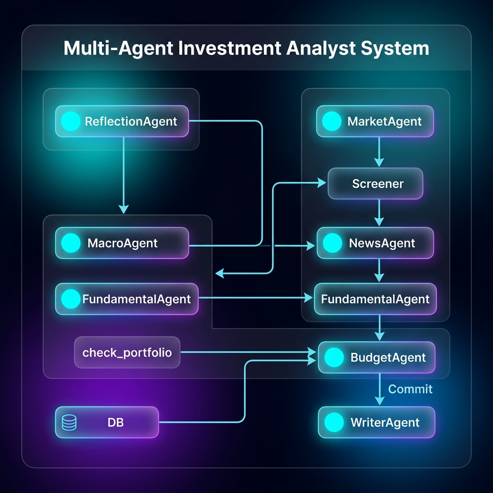
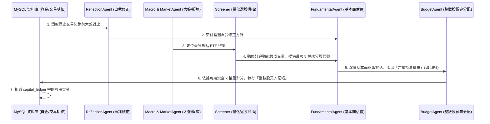

# AI 多代理人投資決策與預算管理系統架構說明書
# (AI Multi-Agent Investment Analyst & Budget Management System Architecture)

本文件旨在詳細闡明本專案中多代理人協作系統 (Multi-Agent System) 的架構設計、核心代理人的分工、決策與預算數據流轉機制，以及實時風控對帳閉環流程。

---

## 1. 系統架構與關聯心智圖 (System Architecture Diagram)

以下是系統代理人間的協作關係圖。它展示了各個代理人如何圍繞著「數據源」、「量化掃描」與「預算記帳」進行高效的閉環決策：

---

## 2. 核心 AI 代理人與組件職責

| 代理人角色 (Agent Role) | 主要職責 (Primary Responsibilities) | 輸入數據 (Inputs) | 輸出結果 (Outputs) |
| :--- | :--- | :--- | :--- |
| **自我反思師 (`ReflectionAgent`)** | 讀取資料庫中的歷史交易表現，並對比大盤指數，產出交易偏好修正指令。 | 歷史 active/closed 交易明細、大盤 Benchmark 指數回報率 | 區域專屬之**自我修正決策指令**（直接輸入至 `FundamentalAgent`） |
| **總經分析師 (`MacroAgent`)** | 分析該區域市場的總體經濟環境與指標，確立中線趨勢基調。 | 大盤指數行情、實時巨觀財經新聞 RSS 內容 | 區域市場**總體經濟分析報告** |
| **板塊分析師 (`MarketAgent`)** | 對行業板塊 ETF 進行強度排序與動能比對，挑選當週吸金板塊。 | 行業板塊 ETF 過去 1 週/1 個月的漲跌幅數據 | 當週**最强焦點行業 ETF** (如 SMH, XLK, 0056) |
| **消息分析師 (`NewsAgent`)** | 深度挖掘個股近期重大新聞、財報發布與產品催化劑的情緒波動。 | 個股 RSS 新聞、分析師評論、重大消息列表 | **個股消息面情緒與催化劑評估** |
| **基本面分析師 (`FundamentalAgent`)** | 解讀利潤率、PEG、負債率與現金流。融合修正指令、總經報告與消息情緒，算出買入區間與目標停損價。 | 企業基本面財務指標 (PE, PEG, ROE, FCF 等)、總經報告、修正指令、個股新聞分析 | **個股基本面深度評估報告**、精確目標價、停損價、推薦評級與**建議持倉權重** (如 10%, 15%) |
| **預算管理員 (`BudgetAgent`)** | 管理雙向記帳帳本與貨幣分區。計算可用資金，執行**整數股**部位分配，更新 Ledger。 | 可用資金餘額、個股現價、AI 建議持倉權重 | **實際買入股數 (整數)**、**實際扣款金額 (含小數點)**、更新後之資料庫資金狀態 |
| **策略總編輯 (`WriterAgent`)** | 將總經、板塊、動態個股報告與反思決策進行高度的策略整合，編撰成週報。 | 所有代理人產出的局部研究報告 | 高質感的策略研報 Markdown / HTML 文件 |

---

## 3. 核心決策與資金流轉工作流 (Workflow Steps)

---

## 4. 預算分配與整數股交易風控防線

在動態遞減資金分配中，為適應真實交易市場，系統採用了嚴格的**「整數股買入防線」**：

1. **目標分配金額計算**：
   $$\text{目標預算} = \text{剩餘可用資金} \times \text{AI 建議持倉權重}$$
2. **無條件捨去至整數股**：
   $$\text{買入股數} = \text{floor}\left(\frac{\text{目標預算}}{\text{個股推薦現價}}\right)$$
3. **最低 1 股防線 (Minimum 1 Share Defense)**：
   * 若算出的 `買入股數 < 1` 且 `可用資金 ≥ 推薦現價`：系統會自動調整買入股數為 **1 股**，確保小帳戶也能順利建立跟隨部位。
   * 若 `可用資金 < 推薦現價`：則不予交易。
4. **精確小數位實際扣款**：
   $$\text{實際扣款金額} = \text{買入股數 (整數)} \times \text{推薦現價}$$
   整數股買入後，扣款金額會精確計算至小數點。剩餘的資金會回籠到可用資金池，供下一檔股票進行動態分配。

---

## 5. 即時風控與資金回籠閉環 (Real-time Closed-Loop)

系統部署有 `check_portfolio.py` 對帳腳本（0-Token 運行），負責與資料庫交互：
* **每日監控**：抓取市場現價，比對 active 推薦中的個股。
* **觸發平倉**：當市價達到 **中線目標價 (Target Price)** 或跌破 **防禦停損點 (Stop Loss)** 時，自動觸發 SELL 賣出。
* **資金回籠**：通知 `BudgetAgent` 結算實現盈虧 (PnL)，並將 **本金 + 實現損益** 全數自動歸還至 `capital_ledger` 的可用資金中。
* **反思學習**：平倉的紀錄將成為下一次 Pipeline 啟動時 `ReflectionAgent` 的核心反思數據，形成一個具備自我學習與迭代能力的閉環式量化分析系統。

---

## 6. 未來經驗累積與記憶升級規劃 (Future Memory & Experience Upgrades)

為了進一步強化系統的連續經驗學習能力，防止每次反思產生的「新規則覆蓋舊經驗」，本專案的長期規劃中已列入以下三軌記憶機制（Backlog 階段）：

### 6.1 適應性規則庫資料表 (Adaptive Rules Ledger)
*   **功能描述**：在資料庫中獨立維護決策條文，實現增量式「修法」，而非全盤重寫。
*   **工程設計**：
    *   在 MySQL 中建立 `system_directives` 資料表，以版本號與唯一標識記錄所有生效的交易與選股偏好規則。
    *   更新 `ReflectionAgent` 的推理邏輯：在啟動覆盤時，強制讀取現有規則庫，並要求其以「只對失效規則進行修正，或新增新規則」的增量修改模式運作，確保歷史驗證有效的經驗不被遺忘。

### 6.2 市場情境檢索庫 (Market Regime RAG)
*   **功能描述**：將歷史重大獲利與虧損案例的財務與宏觀背景進行向量化存檔，在選股時自動比對，實現「前車之鑑」的自動化情境提示。
*   **工程設計**：
    *   引入輕量級向量資料庫（如 pgvector 或 Chroma）。
    *   在每次交易平倉結算時，將當時的個股財報特徵與總經環境指標轉化為語意向量 (Vector Embeddings) 並寫入 RAG 數據庫。
    *   新選股時，大模型調用向量檢索比對當前特徵，並拉取歷史上最相似的 3 筆平倉成功/失敗案例做為 In-Context Learning 脈絡，防範踩中相同的投資地雷。

### 6.3 本地專屬模型微調 (Local Fine-Tuning)
*   **功能描述**：將長期運行累積下來的專屬對帳、覆盤反思與回報率數據集，直接熔刻為本專案專屬的模型大腦。
*   **工程設計**：
    *   當系統於沙盒運行達 6-12 個月後，將資料庫中的定量對帳數據與代理人的定性分析數據導出為標準 JSONL 微調格式。
    *   採用 LoRA 等輕量化微調技術，對 Llama 3 或是 Mistral 等開源模型進行微調，使模型的基礎神經元權重直接獲得適應此交易框架的直覺與風險控制能力。
