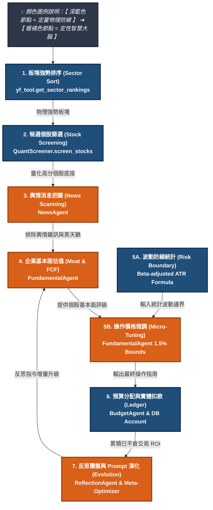

# 🧠 量化與基本面（Quantmental）多代理人決策系統演算法邏輯手冊
**System Algorithm Architecture & Quantmental Operational Manual**

> [!NOTE]
> 本文件為「投資研究多代理人決策系統」之核心演算法邏輯與系統架構教育手冊。旨在詳細紀錄並釐清系統中「定量物理防線（定量電腦）」與「定性智慧大腦（定性人腦）」之間的邊界劃分、數據管線遞移、動態風險防線計算公式，以及「定量錨定，定性微調」的核心哲學。本文件將做為系統的「活檔期維護指南」，於後續功能變更時同步更新。

---

## 🌍 一、 量化與定性結合（Quantmental）之哲學核心

在現代金融交易中，純量化（Quantitative）與純定性（Qualitative/Fundamental）各有其不可避免的致命盲區：
1. **純量化模型的盲區**：對數據存在**滯後性（Latency）**，無法理解人類語言，容易在公司面臨訴訟、核心團隊跳槽、財務造假等「黑天鵝定性事件」時，因為技術面指標依然好看而踩雷。
2. **純定性分析的盲區**：人類分析師容易受到**主觀情緒偏見（Speculative Bias）**、貪婪與恐懼的影響，無法嚴格遵守交易紀律，且在大規模數據初選時效率極低。

本系統設計之初，即採用了 **Quantmental 雙軌交織管線**：
*   **定量算法（守門員）**：負責粗篩與極速過濾 95% 的低流動性與無動能標的，提供一個具備高統計勝率的物理底座。
*   **定性 AI 代理人（CIO）**：在安全的物理小池子裡，用商業邏輯、新聞解讀與覆盤教訓進行去蕪存菁，守住最後 5% 的風險防線。

---

## 📊 二、 系統黃金十字架架構（The Golden Cross）

系統黃金十字架展示了系統從「大盤趨勢」到「實體記帳」的 7 大決策階段中，定量與定性兩大力量的具體分工，以及各自負責的程式模組與 AI 代理人（Agent）：



### 📋 系統決策階段與模組權責對照表

| 決策階段 | 🛡️ 量化物理防線 (負責模組/工具) | 🧠 大模型定性決策 (負責代理人/Agent) |
| :--- | :--- | :--- |
| **1. 板塊趨勢選擇** | **100% 定量過濾**<br>👉 `yf_tool.get_sector_rankings`<br>*板塊 ETF 週回報率定量計算與排序* | **資金流向成因與熱點解讀**<br>👉 **`MarketAgent` (板塊動能分析師)**<br>*解讀巨觀成因、判斷資金流入/流出板塊* |
| **2. 候選個股篩選** | **100% 定量篩選**<br>👉 `QuantScreener.screen_stocks`<br>*5日價格動能、量能噴發因子、市值與日均量門檻* | **（無）**<br>*此階段不調用大模型，100% 物理過濾，極速降噪並節省 Token 成本* |
| **3. 個股消息面把關** | **數據基礎提供**<br>👉 `search_tool.get_stock_news`<br>*Scraper 即時網頁新聞檢索模組* | **上漲純度與黑天鵝定性判定**<br>👉 **`NewsAgent` (輿情消息分析師)**<br>*解讀新聞是實質利多還是投機炒作，預警黑天鵝* |
| **4. 企業基本面估值** | **數據基礎提供**<br>👉 `yf_tool.get_stock_financials`<br>*自動拉取財務三表、估值指標與債務結構* | **護城河剖析與估值陷阱判定**<br>👉 **`FundamentalAgent` (基本面估值師)**<br>*動態分析 PEG 廉價度、企業定價權、財務健康度* |
| **5. 風險防線設定** | **波動度物理邊界統計**<br>👉 `yf_tool.get_stock_financials`<br>*歷史 Beta 與 ATR-14 波動停損/停利參考價* | **最終操作區間與投資評級判定**<br>👉 **`FundamentalAgent` (基本面估值師)**<br>*結合大盤情境與反思指令，微調停損點並決定評級* |
| **6. 資金預算分配** | **持股對帳與記帳物理防線**<br>👉 `db_manager.py` & `check_portfolio.py`<br>*帳戶每日 NAV 智慧對帳與自動平倉控制* | **主觀勝率折價與動態預算配置**<br>👉 **`BudgetAgent` (預算管理與持倉代理人)**<br>*讀取個股定性評級，動態扣除可用餘額與分配購買股數* |
| **7. 覆盤反思與演化** | **已平倉交易 ROI 追蹤**<br>👉 `db.get_recent_inference_logs_with_roi`<br>*真實交易績效與推論日誌資料庫綁定技術* | **定性反思與 Prompt 版本遞增升級**<br>👉 **`ReflectionAgent` (自我修法師)**<br>*每週反思定性指令*<br>👉 **`MetaPromptOptimizer` (自適應演化引擎)**<br>*Meta-Reflection 生成優化 Prompt 並升級版本* |

---

## ⚖️ 三、「定量錨定，定性微調」之運作邏輯

這套系統的靈魂在於「人機協同」的深度耦合。在核心的 **「停損價/停利價設定 (第 5 步驟)」** 與 **「資金分配控制 (第 6 步驟)」** 中，系統實現了完美的互補：

### 1. 停損停利防線：定量統計錨定，大腦 1.5% 微調
系統拋棄了市場上粗暴的「統一跌 8% 停損、漲 15% 停利」設計，改採**「Beta 調整之 ATR 波動通道算法」**進行物理錨定。

#### 📐 計算公式 (純 ASCII 格式)
當您需要查閱或在其他腳本中調用波動停損停利公式時，請遵循以下數學關係：
```text
# Step A: 限制 Beta 邊界 (Winsorization) 以平滑極端值
beta_bounded = max(0.3, min(Beta, 3.0))

# Step B: 進行開根號統計縮放 (Square Root Scaling)
beta_adj = sqrt(beta_bounded)

# Step C: 計算動態波動乘數
# k1: 停損乘數 (以 2.0 倍 ATR 日震幅為基礎)
# k2: 停利乘數 (以 3.0 倍 ATR 日震幅為基礎)
k1 = 2.0 * beta_adj
k2 = 3.0 * beta_adj

# Step D: 計算建議停損與停利參考價 (錨定底座)
Suggested_Stop_Loss = Buy_Price - (k1 * ATR_14)
Suggested_Target_Price = Buy_Price + (k2 * ATR_14)
```

#### 備援安全防線 (Fallback Line)
若因個股新上市或數據庫暫時缺失而無 ATR_14 或 Beta 數據時，系統強制套用以下物理防線：
```text
Stop_Loss_Fallback = Buy_Price * 0.92  (固定 8% 停損)
Target_Price_Fallback = Buy_Price * 1.15  (固定 15% 停利)
```

#### 🧠 大模型定性 1.5% 彈性微調
上述物理錨定價算出後，會作為 `Context` 灌入 **`FundamentalAgent`** 的提示詞中。大模型被施加了強剛性紀律約束：
1. **紀律防線**：無極其強烈之理由，必須直接採用系統建議的波動參考價。
2. **定性微調**：允許大模型在 **正負 1.5%** 的極小範圍內，結合「歷史壓力支撐位」或「心理整數關卡」進行微調（例如：將定量算出的 `91.43` 微調為更具心理支撐力的整數 `91.00` 元）。這既保證了統計學的剛性底線，又保留了專業交易員的定性靈活性。

---

### 2. 資金生殺大權：評級決定預算 (Budget Veto Vicious Block)
即使第 1、2 階段的定量篩選極度看好某檔個股，如果第 3、4 階段的 **`FundamentalAgent`** 與 **`NewsAgent`** 發現了估值泡沫、催化劑不純或黑天鵝，大模型會直接透過「調降評級」來執行實質上的資金閹割：

```text
大模型評級為 Strong Buy ➔ BudgetAgent 動態分配 20% ~ 25% 資金 (高勝率重倉)
大模型評級為 Buy        ➔ BudgetAgent 動態分配 10% ~ 15% 資金 (中性配置)
大模型評級為 Hold       ➔ BudgetAgent 動態分配 5% 資金 (定性推翻，資金物理閹割)
```

藉由將評級與資金大小物理掛鉤，系統在不破壞數據庫完整性（保留研究日誌以供自我演化）的前提下，完美阻止了垃圾標的對投資組合淨值的侵蝕！

---

## 🧠 四、 自適應 Prompt 演化機制 (Phase 7: Self-Evolution)

這套系統不單只是一個交易程式，它是一個**「會自主學習的生命體」**。

當沙盒模擬進行時，隨著每日對帳（`check_portfolio.py`）持續判定平倉，系統會自動在資料庫累積實際交易損益（ROI）。每週週報生成管線末端會自動啟動 **`MetaPromptOptimizer`**（自適應演化引擎）：

1.  **對比學習法 (Contrastive Learning)**：
    自動提取最近 10 筆平倉紀錄，並歸類為**成功案例 (ROI > 0)** 與**失敗案例 (ROI <= 0)**。
2.  **增量編譯模式 (Incremental Update)**：
    Meta-Agent 會針對失敗案例中大模型的估值失真（如：過度樂觀估值、未嚴格遵循 ATR 風控、對高負債比視而不見）進行深度反思，在保持 `FundamentalAgent` 核心結構與輸出 Markdown 格式不變的前提下，於 Prompt 末尾新增 **「【自適應演化之最新交易紀律防線】」**。
3.  **版本遞增與即時啟用**：
    新 Prompt 自動寫入 `prompt_registry` 並標記為 active 啟動，版本號自動遞增（如 `v1.0.0` ➔ `v1.0.1`）。下一週週報啟動時，`FundamentalAgent` 就會自動裝載這套帶有「痛過記憶」的新防線，杜絕重蹈覆轍！

---

## 🛡️ 五、 反隨機之盾防禦機制（The Aegis Shield - Final Milestones）

Aegis（英文意為「神之盾」）系統的核心設計哲學，正是**「防禦隨機噪聲，獵殺系統偏誤，利用統計期望值賺錢」**。

本系統目前已經導入並運作的四大核心防禦與獲利機制如下，它們分工合作，共同實現了「賠小賺大」與「規避系統性大跌」的目標：

### 機制一：不對稱盈虧比設計 ——「賠小賺大」的數學地基
系統不追求 100% 的勝率，而是透過動態 ATR（真實波幅均值）波動區間鎖定「賠小賺大」的結構。
*   **實作位置**：`aegis_cli.py` 與 `FundamentalAgent`
*   **運作方式**：
    *   當系統決定買入個股時，停損價與目標價絕非硬編碼，而是以個股過去 20 天的 ATR（波動度）為基準進行計算。
    *   **防禦停損點**：通常設定在當前價格下方約 $1.0 \sim 1.5 \times \text{ATR}$（波動度內的安全範圍，避免隨機噪聲掃出場）。
    *   **中線目標價**：通常設定在當前價格上方約 $2.0 \sim 3.5 \times \text{ATR}$。
    *   **結果**：這在單筆交易上強行創造了 $1:2$ 或 $1:3$ 的「風險回報比（Risk/Reward Ratio）」。在這樣的數學結構下，系統即使勝率只有 40%，長期執行下來依然能實現可觀的淨值增長。

### 機制二：波動度調節持倉與安全金機制 —— 防止「單點崩潰」
隨機市場中，任何單一個股都有暴雷的風險（例如隨機的財報造假或極端黑天鵝事件）。
*   **實作位置**：`budget_agent.py`
*   **運作方式**：
    *   **資金安全鎖（Reserved Cash）**：系統要求台股帳戶必須保留 200,000 TWD，美股帳戶保留 20,000 USD 作為「絕對安全準備金」，任何時候皆不可動用，防範系統性流動性危機。
    *   **風險平價思想的持倉分配**：買入時，大模型給出的推薦評級（Buy/Strong Buy）與個股波動率，會經由 `BudgetAgent` 的算法重新分配預算。波動率極高的股票會被自動分配較少的股數與資金，防止單一高風險股票的隨機大跌重創總淨值。

### 機制三：總經情境閘門（Regime Shifting）—— 避開「系統性崩潰」
在金融市場中，最大的危險不是個股隨機波動，而是大盤系統性崩盤（Beta 崩潰，如 2008 金融海嘯或 2020 疫情崩盤）。
*   **實作位置**：`MacroAgent` 決策與 `monitor_performance.py`
*   **運作方式**：
    *   每週六早上，系統會執行總經評估，並將市場打上情境標籤（如 `BULL_RISK_ON` 或 `BEAR_RISK_OFF`）。
    *   **情境干預**：一旦市場被判定為 `BEAR_RISK_OFF`（熊市避險），這個標籤會作為硬規則干預所有代理人。此時系統會：
        1. 大幅收緊新標的的買入門檻。
        2. 強制調緊在庫股的停損點（更早平倉離場）。
        3. 在庫持股的建議權重上限被自動下修，藉此避開系統性大跌的「屠殺期」。

### 機制四：閉環風控哨兵（Watchdog）與反思反饋 —— 系統的「痛覺神經」
當隨機性累積，導致總投資組合出現超乎預期的連續虧損時，系統擁有主動剎車與反省機制。
*   **實作位置**：`monitor_performance.py` 的 LINE Watchdog 機制與 `aegis_cli.py` 的 `run_regional_reflection`
*   **運作方式**：
    *   **回撤警戒線（MDD > 3%）**：風控哨兵每日收盤後自動計算台股與美股口袋的「最大回撤（MDD）」與「自峰值累計降幅」。一旦回撤突破 3.0% 的風險閥值，系統會立即拉響警報，暫停主動買入。
    *   **反思修正指令注入**：如前述，歷史平倉的虧損數據與當初的推論日誌會被 `ReflectionAgent` 對照分析，找出模型的「邏輯死角」，並以 `reflection_directives` 形式動態注入到大模型的輸入端，確保同一個坑系統不會摔進去第二次。

### 💡 總結 Aegis 的盾牌特質
這四大機制在 Aegis-MAQS 中構成了一個閉環風控矩陣：
*   **情境閘門** 幫我們擋下大盤的「系統性大雨」（避開熊市）。
*   **波動度持倉與安全金** 幫我們擋下個股的「隨機落雷」（防範個股黑天鵝）。
*   **不對稱盈虧比** 確保我們在「晴天時能大步前進，雨天時只會小跌」（賠小賺大）。
*   **風控哨兵與反思** 則是我們的「防滑煞車與自我進化系統」。

這些機制的綜合成效，讓 Aegis-MAQS 在面對充滿不確定性的金融市場時，能夠真正發揮出「反隨機」的累積統計優勢。

---

## 📝 六、 文件維護與升級規範

1. **變更追蹤**：凡是修改 `yahoo_finance.py` 中的波動停損停利倍數、`screener.py` 中的篩選因子權重，或是 Agent 的核心角色，必須同步在本手冊中修訂對應的 ASCII 算式或架構圖。
2. **版本共存**：此手冊應常駐於大腦目錄（`Aegis-MAQS/docs/`），做為每次 Agent 喚醒時進行架構對齊與自我教育的 Single Source of Truth（唯一真理源）。
