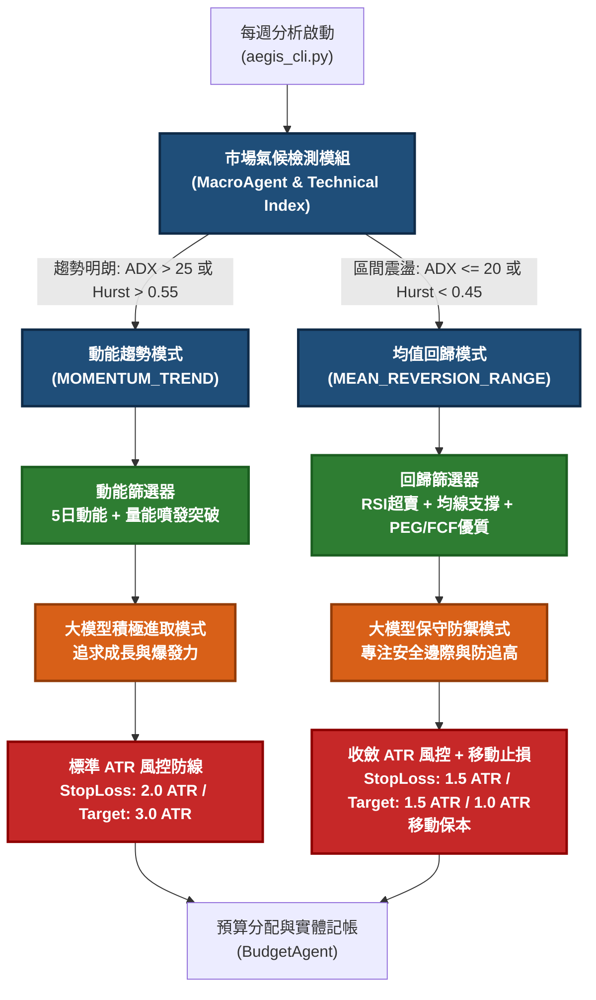

# 🚀 Aegis-MAQS 系統升級計畫：主動適應均值回歸市場
**System Upgrade Blueprint: Active Adaptation to Mean-Reverting Markets**

> [!NOTE]
> 本文件詳列了 Aegis-MAQS 系統從現行之「動能突破/趨勢追蹤（Trend-Following）」策略，升級為具備「市場氣候感知」與「動能/回歸雙軌自適應交易」的架構藍圖。旨在克服動能崩潰（Momentum Crash）帶來的連續性止損失血，並在大盤處於區間震盪（Range-bound）或均值回歸（Mean Reversion）的環境中，主動捕捉被超賣的優質資產。

---

## 🗺️ 一、 架構升級核心藍圖 (Architectural Overview)

本次升級旨在原本的量化篩選與 AI 決策流程中，加入一條**「市場氣候（Regime）判定分支」**。系統將依據市場氣候動態切換底層的量化篩選因子、大模型性格提示詞，以及出場風控參數。



---

## 📅 二、 四階段逐步導入計畫 (Implementation Phases)

我們將本升級計畫劃分為四個獨立且可單獨測試的階段：

### 🎯 第一階段：大盤氣候均值回歸檢測器 (Market Regime Detector)
*   **目標**：為系統建立客觀判斷「動能市」或「回歸市」的數學指標。
*   **具體實作**：
    1.  在 `backend/core/tools/screener.py` 或獨立的 `RegimeDetector` 中計算大盤指數（美股 S&P 500、台股加權指數）的技術指標。
    2.  指標標準：
        *   **ADX-14 (Average Directional Index)**：低於 20 表示趨勢極弱，進入震盪盤。
        *   **Hurst Exponent (赫斯特指數)**：小於 0.45 說明市場具有顯著的均值回歸（反持久性）特徵。
        *   **RSI-14 (相對強弱指標)**：大盤 RSI 處於 $45 \sim 55$ 之間，且日 K 線在 50MA 附近來回穿梭。
    3.  **輸出**：每週分析時，將判定結果 `market_regime = "MOMENTUM_TREND" | "MEAN_REVERSION_RANGE"` 寫入資料庫及系統設定中。

---

### 🎯 第二階段：量化因子與篩選邏輯動態切換 (Dynamic Screener)
*   **目標**：確保在回歸市中，系統不會將在高點突破的個股塞入候選名單，而是主動發掘被錯殺的優良標的。
*   **具體實作**：
    1.  重構 `screener.py` 中的 `QuantScreener.screen_stocks`：
        *   `if market_regime == "MOMENTUM_TREND"`: 沿用現行之動能及成交量爆發篩選邏輯。
        *   `elif market_regime == "MEAN_REVERSION_RANGE"`: 切換至**拉回買進篩選模組**。
    2.  **拉回買進篩選準則 (Pullback Screening Rules)**：
        *   **安全邊際**：近 4 季 EPS 合計為正，利息保障倍數 $> 3$ 倍，確保無債務危機之黑天鵝。
        *   **超賣檢測**：`RSI-14 < 38` 或 股價較近 20 天高點回撤達 $10\% \sim 15\%$，但仍在長期 200MA 之上。
        *   **支撐確認**：股價位於 50MA 上方 $2\% \sim 5\%$ 的合理支撐區間。
        *   **估值吸引力**：本益比 PE 低於同行業中位數，且 PEG $< 1.2$。

---

### 🎯 第三階段：大模型定性防追高與超買約束 (Anti-Chasing Veto)
*   **目標**：防止大模型在接收到突發動能股時產生順週期偏見（追高），對偏離內在價值的股票一鍵否決。
*   **具體實作**：
    1.  修改 `FundamentalAgent` 提示詞範本，新增 **【防追高防禦指令】**。
    2.  **硬性約束規則**：
        *   系統會將個股的 `正乖離率 (Price / 50MA - 1)` 與 `RSI-14` 作為參數傳入。
        *   當 `market_regime == "MEAN_REVERSION_RANGE"`，且標的 `正乖離率 > 15%` 或 `RSI > 75` 時，大模型被施加**剛性紀律約束**：評級最高只能給予 `Hold`（將預算限制在最少 5%），或直接給予 `Sell`（否決交易）。
        *   提示詞範本更新：
          ```text
          ⚠️ 系統風控警告：目前大盤氣候為【均值回歸震盪市】。
          如果此標的的 RSI 已經大於 70，且價格偏離 50 日均線大於 15%，你必須抱持強烈懷疑態度，優先給予 Hold 或 Sell 評級。
          必須在研報中詳細評估追高的回撤風險，並計算安全邊際。
          ```

---

### 🎯 第四階段：收斂波動盈虧比與移動止損 (Trailing Stop & Dynamic TP)
*   **目標**：在震盪和反覆回歸的市況中縮短戰線，儘速鎖定微小利潤，避免利潤吐回。
*   **具體實作**：
    1.  修改停損停利計算邏輯（於 `aegis_cli.py` 或核心運算中）：
        *   若 `market_regime == "MEAN_REVERSION_RANGE"`：
            *   **停損乘數 ($k_1$)**：從 $2.0 \times \text{Beta}_{adj}$ 降至 $1.2 \sim 1.5 \times \text{Beta}_{adj}$。
            *   **停利乘數 ($k_2$)**：從 $3.0 \times \text{Beta}_{adj}$ 降至 $1.2 \sim 1.5 \times \text{Beta}_{adj}$（鎖定震盪區間高低點）。
    2.  **移動止損防線（Trailing Stop-Loss）**：
        *   在對帳與平倉判定模組（`check_portfolio.py` 及 `monitor_performance.py`）中，引入 **Break-Even（保本）觸發器**：
        *   一旦持股獲利曾達到 $1.0 \times \text{ATR}$，系統會自動在資料庫中將該交易的停損價，調整為該筆交易的**「推薦買入價（保本點）」**。
        *   後續即使股價發生強烈均值回歸，該交易也將以 0% 損益（扣除摩擦成本）保本平倉，杜絕「獲利變虧損」的窘境。

---

## 🛠️ 三; 系統代碼修改指引 (Code Implementation Guide)

以下列出各升級階段涉及的主要程式碼位置，便於後續開發與版本控制：

| 升級階段 | 關鍵檔案路徑 | 主要修改內容與目標 |
| :--- | :--- | :--- |
| **第一階段** | [db_manager.py](file:///home/gordon/learning/program/python/Aegis-MAQS/backend/core/db_manager.py) | 1. 於資料庫中新增大盤技術狀態與 `market_regime` 之快取欄位。<br>2. 整合大盤 ADX 與 Hurst 計算函數。 |
| **第二階段** | [screener.py](file:///home/gordon/learning/program/python/Aegis-MAQS/backend/core/tools/screener.py) | 1. 在 `QuantScreener` 中引入大盤 `market_regime` 判斷。<br>2. 新增 `_screen_mean_reversion_pullbacks()` 函數，實現超賣與支撐因子篩選。 |
| **第三階段** | [fundamental_agent.py](file:///home/gordon/learning/program/python/Aegis-MAQS/backend/core/agents/fundamental_agent.py) | 1. 在 `FundamentalAgent` 核心 System Prompt 中加入「震盪市防追高約束」與評級限制。<br>2. 將個股 RSI 與乖離率指標傳入 Prompt Context。 |
| **第四階段** | [monitor_performance.py](file:///home/gordon/learning/program/python/Aegis-MAQS/backend/monitor_performance.py)<br>[aegis_cli.py](file:///home/gordon/learning/program/python/Aegis-MAQS/backend/aegis_cli.py) | 1. 調整風控乘數，加入移動止損（Trailing Stop）狀態管理。<br>2. 實作對帳判定時自動修正已實現保本停損點之邏輯。 |

---

## 📉 四、 升級後的預期效果與風險防範 (Risk & Metrics)

*   **預期指標變更**：
    *   在均值回歸市場中，單次最大損失金額將減少約 **30% ~ 40%**（受益於收緊停損與保本點移動）。
    *   在震盪市中的交易次數會略微上升，但每筆交易的存活時間將會收縮，資金使用效率更高。
    *   系統的整體勝率（Win Rate）在大盤無趨勢時能維持在 **50% 以上**（受益於拉回買進低估資產的統計優勢）。
*   **風險防範**：
    *   **雙重噪音磨損**：如果大盤反覆在「動能/回歸」之間極速切換（即所謂的 "Whipsaw" 雙邊洗盤），可能會導致系統頻繁切換策略並被雙邊摩擦。
    *   **防範策略**：氣候切換設定 7 ~ 14 天的冷卻期鎖定，避免系統在短期內因大盤單日大漲大跌而頻繁切換 `market_regime` 狀態。
